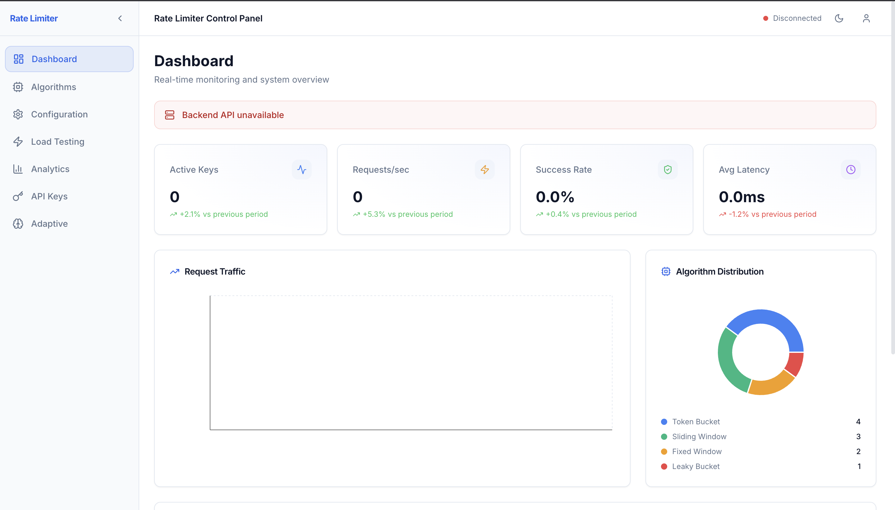

# 🚀 ThrottleX

> Production-ready distributed rate limiter monorepo with **5 algorithms**, **Redis backing**, **adaptive ML rate limiting**, **geographic awareness**, and a **React-based Admin Dashboard**.

[](https://nodejs.org)
[](https://www.typescriptlang.org)
[](https://redis.io)
[](https://react.dev)
[](LICENSE)

---
## 🚀 Live Demo

🔗 https://throttlex-2.onrender.com
🔗 https://throttlex-frontend1-vgpg.onrender.com

---

## 📸 Preview

<p align="center">
  
</p>

---
## ✨ Key Features

| Feature | Description |
|---------|-------------|
| 🏃 **High Performance** | 50,000+ requests/second with <2ms P95 latency |
| 🎯 **5 Algorithms** | Token Bucket, Sliding Window, Fixed Window, Leaky Bucket, Composite |
| 🤖 **Adaptive ML** | EMA + Z-score anomaly detection for automatic limit optimization |
| 🌍 **Geo Limiting** | Country-level limits with Cloudflare/CloudFront CDN header support |
| 🌐 **Distributed** | Redis-backed atomic Lua scripts for multi-instance safety |
| 📊 **Admin Dashboard**| React + Vite frontend with Radix UI and Recharts for metrics visualization |
| ⚡ **Production Ready** | Circuit breaker, fallback limiter, Prometheus metrics |
| 🛡️ **Thread Safe** | Atomic Redis operations — no race conditions |
| 📊 **Rich Metrics** | Prometheus + P50/P95/P99 latency histograms |
| 🧪 **Tested** | Vitest unit + integration + load test suites |
| 🐳 **Container Ready** | Multi-stage Dockerfile + Docker Compose + Kubernetes manifests |

---

## 📁 Project Structure

```text
ThrottleX/
├── backend/            # Express API, Redis Lua scripts, Controllers
│   ├── src/            # Core backend logic (algorithms, adaptive ML, geo)
│   └── tests/          # Unit, integration, and load tests
├── frontend/           # React + Vite admin dashboard
│   └── src/            # Components, pages, and API integration
├── shared/             # Shared TypeScript types and utilities
├── docker/             # Dockerfile + Docker Compose setups
├── docs/               # Architecture and algorithm deep-dives
├── k8s/                # Kubernetes base manifests + environments
└── scripts/            # Utility scripts (benchmark, redis-init)
```

---

## 🚀 Quick Start

### Prerequisites
- Node.js 18+ (20+ recommended)
- npm (or pnpm)
- Redis running locally on port 6379 (for local development without Docker)

### Using Docker Compose (Recommended)

```bash
# Clone & start
git clone <repo-url>
cd ThrottleX

# Start Redis + backend + frontend
docker-compose -f docker/docker-compose.yml up --build -d

# Verify Backend
curl http://localhost:3000/health

# Access Dashboard
# Open http://localhost:5173 in your browser
```

### Local Development

This project uses npm workspaces. You can run all services concurrently from the root.

```bash
# Install dependencies for all workspaces
npm install

# Setup environment variables
cp .env.example .env

# Run tests (no Redis needed for unit tests)
npm test
```

- The backend will start on `http://localhost:3000`.
- The frontend admin dashboard will start on `http://localhost:5173`.

---

## 📡 API Reference

*(See the [Docs](docs/) for more extensive documentation)*

### Rate Limit Check
```http
POST /rate-limit/check
Content-Type: application/json

{
  "key": "user:12345",
  "algorithm": "token_bucket",
  "limit": 100,
  "windowMs": 60000
}
```

**Response:**
```json
{
  "allowed": true,
  "remaining": 99,
  "limit": 100,
  "resetMs": 1736000000000,
  "algorithm": "token_bucket",
  "key": "user:12345",
  "latencyMs": 1
}
```

### Health Check
```http
GET /health           # Full health status
GET /health/live      # Liveness probe
GET /health/ready     # Readiness probe
```

### Metrics
```http
GET /metrics          # Prometheus text format
GET /metrics/json     # JSON snapshot
```

### Admin (requires X-Admin-Key header)
```http
GET    /admin/limits           # List all overrides
POST   /admin/limits           # Set a limit override
DELETE /admin/limits/:key      # Remove an override
```

### Benchmark
```http
POST /benchmark/run
{
  "scenario": "sustained",
  "concurrency": 50,
  "durationMs": 10000,
  "algorithm": "sliding_window"
}
```

---

## 🎯 Algorithms

| Algorithm | Best For | Atomic Op | Key Type |
|-----------|----------|-----------|----------|
| **Token Bucket** | APIs with burst allowance | HSET/HGET | Hash |
| **Sliding Window** | Precise fairness | ZADD/ZRANGE | Sorted Set |
| **Fixed Window** | Simple counters | INCR/EXPIRE | String |
| **Leaky Bucket** | Traffic shaping | HSET/HGET | Hash |
| **Composite** | Multi-dimensional limits | Combined | Multiple |

---

## 🤖 Adaptive ML Rate Limiting

The adaptive engine uses **Exponential Moving Average (EMA)** tracking + **Z-score anomaly detection** to automatically adjust limits:

```
Signal Types:
  THROTTLE   → Traffic spike detected (z-score > 2.5) → reduce limit
  SCALE_UP   → Traffic drop detected → relax limit
  ALERT      → High rejection rate (>80%) → notify
  STABLE     → Normal operation
```

Enable with `ADAPTIVE_ENABLED=true` in `.env`.

---

## 📊 Response Headers

Every rate-limited response includes:

| Header | Description |
|--------|-------------|
| `X-RateLimit-Limit` | Maximum requests allowed |
| `X-RateLimit-Remaining` | Requests remaining in window |
| `X-RateLimit-Reset` | Unix timestamp of window reset |
| `X-RateLimit-Algorithm` | Algorithm used |
| `Retry-After` | Seconds until retry (on 429) |
| `X-Correlation-ID` | Request correlation ID |

---

## 🐳 Docker

```bash
# Standard Docker deployment
docker-compose -f docker/docker-compose.yml up -d

# Redis cluster (6-node: 3 masters + 3 replicas)
docker-compose -f docker/docker-compose.redis-cluster.yml up -d

# Build image only
docker build -f docker/Dockerfile -t rate-limiter:latest .
```

---

## ☸️ Kubernetes

```bash
# Deploy base manifests
kubectl apply -f k8s/base/

# Production (with HPA, 3-20 replicas)
kubectl apply -f k8s/environments/production/
```

---

## 🧪 Testing

Commands can be run from the root using npm workspaces:

```bash
npm test                  # All unit tests
npm run test:unit         # Unit tests only (no Redis)
npm run test:integration  # Integration tests (needs Redis)
npm run test:coverage     # Coverage report
npm run benchmark         # Benchmark scenario runner
```

---

## 🔧 Configuration

| Variable | Default | Description |
|----------|---------|-------------|
| `REDIS_URL` | `redis://localhost:6379` | Redis connection URL |
| `DEFAULT_ALGORITHM` | `token_bucket` | Default algorithm |
| `DEFAULT_RATE_LIMIT` | `100` | Default request limit |
| `DEFAULT_WINDOW_MS` | `60000` | Default window size (ms) |
| `ADAPTIVE_ENABLED` | `true` | Enable ML adaptation |
| `GEO_ENABLED` | `true` | Enable geo limiting |
| `CIRCUIT_BREAKER_THRESHOLD` | `5` | Failures before opening |
| `PORT` | `3000` | Server port |

---

## 📄 License

MIT © ThrottleX Team
