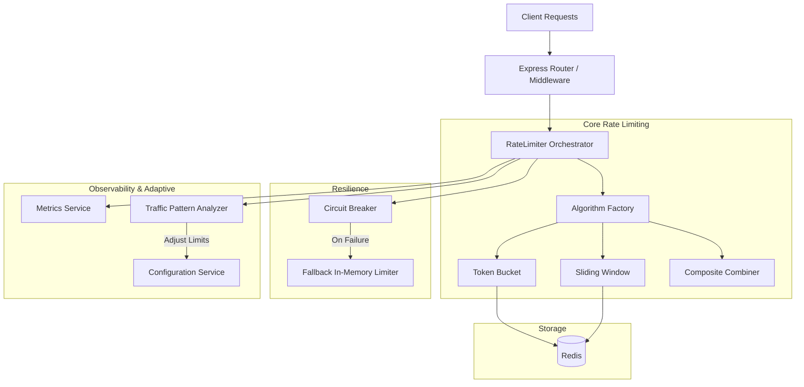

# Architecture Overview

The Adaptive Rate Limiter is designed as a high-performance, distributed, and resilient system for API protection and traffic shaping.

## System Components

## Resilience Design
The system uses a **Fail-Open strategy**. If Redis goes down, the `CircuitBreaker` trips, and the `FallbackLimiter` takes over using an LRU in-memory cache. This ensures the rate limiter never becomes a single point of failure that brings down your API.

## Adaptive Limitations
The `TrafficPatternAnalyzer` computes an Exponential Moving Average (EMA) and Z-Score of traffic volume and rejection rates. Based on these signals (`THROTTLE`, `SCALE_UP`, `STABLE`, `ALERT`), the `AdaptationDecisionEngine` adjusts the effective rate limits dynamically.
